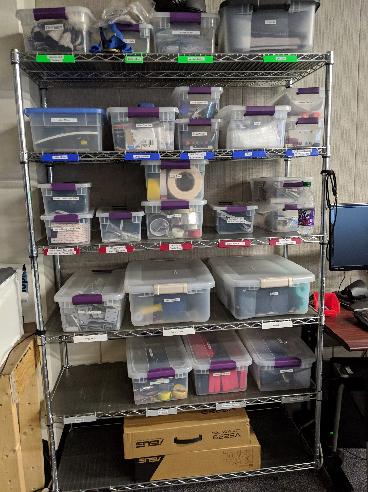
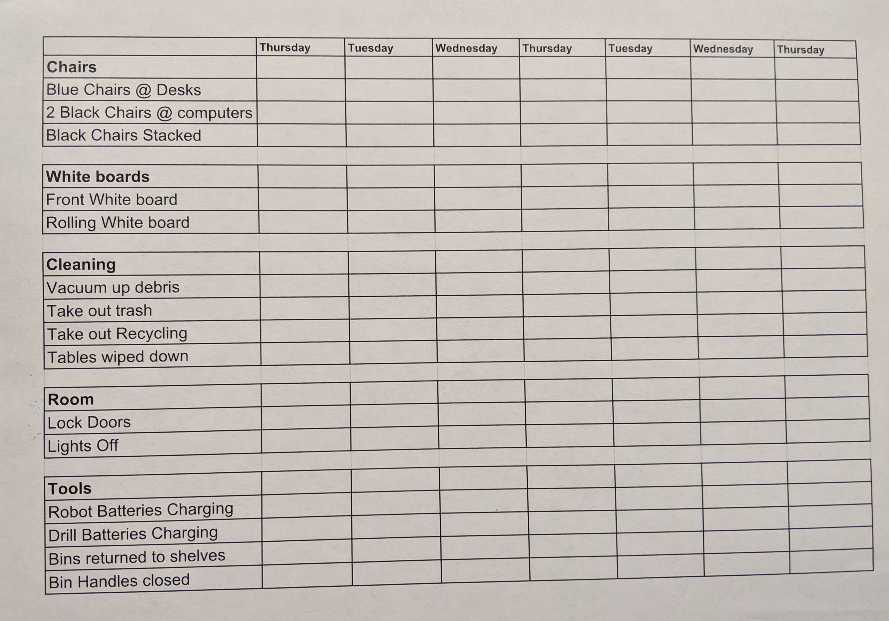

#### Our Lab and Pit are 5S Zones!

 Sort - Organization is key in our pit and our lab.

We use our road cases in both our pits and the lab to increase muscle memory for tool location. Each drawer even has custom dividers!

We even sort our daily tasks with checklists for completion

* * *

 Set in Order - We arrange and label everything.

All containers are labled on 4 sides plus the lid! We have 7 sets of shelves fully labeled with bins in addition to our 2 road cases

* * *

 Shine - We keep everything as clean as we can.

* * *

 Standardize - We've standardized our cleanup with checklists.

* * *

 Sustain - We train new members to sustain our efforts.

* * *

