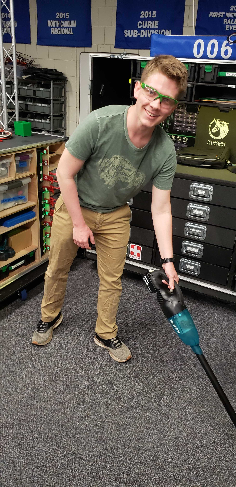

#### Our Lab and Pit are 5S Zones!

 Sort - Organization is key in our pit and our lab.

We use our road cases in both our pits and the lab to increase muscle memory for tool location. Each drawer even has custom dividers!

We even sort our daily tasks with checklists for completion

* * *

 Set in Order - We arrange and label everything.

All containers are labled on 4 sides plus the lid! We have 7 sets of shelves fully labeled with bins in addition to our 2 road cases

It's not just the outsides either, the drawers in our cart all have custom dividers with their own labels. 

* * *

 Shine - We keep everything as clean as we can.

As well as our shop vac, we have a hand-held vacuum which uses the same batteries as our drills. This handheld vacuum comes with us everywhere! 

* * *

 Standardize - We've standardized our cleanup with checklists.

* * *

 Sustain - We train new members to sustain our efforts.

We work closely with NCSSM's Fabrication Lab to help train not just our students, but the entire student body!

* [Belt Sander](assets/docs/NCSSM_Tool_Rubric_-_Belt_Sander.pdf)
* [Drill Press](assets/docs/NCSSM_Tool_Rubric_-_Drill_Press.pdf)
* [Jigsaw](assets/docs/NCSSM_Tool_Rubric_-_Jigsaw.pdf)
* [Power Drill](assets/docs/NCSSM_Tool_Rubric_-_Power_Drill.pdf)
* [Vertical Bandsaw](assets/docs/NCSSM_Tool_Rubric_-_Vertical_Bandsaw.pdf)	
	

* * *

