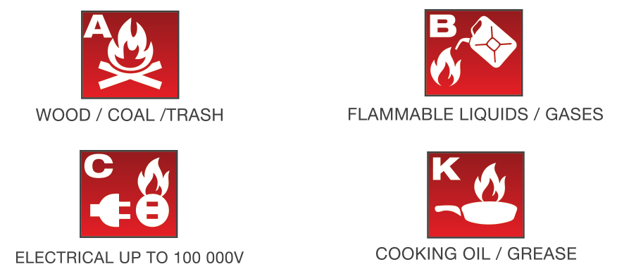

#### Our Pit is a 5S Zone!

 Sort - Organization is key in our pit and in our lab.

 Set in Order - We arrange and label everything.

 Shine - We keep everything as clean as we can.

 Standardize - We've standardized our cleanup with checklists.

 Sustain - We train new members to sustain our efforts.

* * *
#### Be Proactive
We do our best to take a proactive aproach to safety! 
* Safety glasses are kept close at hand to supply both the team and visitors
* Hair ties are easily accessible for anyone with long hair
* We shout "Enabled" before enabling the robot and ensure everyone nearby knows to robot may move

* * *
#### Fire Safety!
We take fire safety seriously. As part of that, we have invested in an Element Fire Extinquisher. Element extinquishers put out all major classes of fire and never expire. 

https://elementfire.com/

* * *
#### First Aid
All members are told to download the Red Cross First Aid app and our mentors have been through basic first aid training. 

Our First-Aid stock includes
* Bandaids (Misc. sizes)
* Anti-Septic Gel
* Nitrile non-latex gloves (S-L)
* CPR Rescue Mask
* Wet Wipes
* Gloves
* Masks
* Benadryll
* Burn Gel 
* Hand Sanitizer
* Tissues
* Sanitary Pads
* Hearing Protection
* Eye care packets
* Cough Drops
* Hair Ties
* Gauze Pads
* Cotton Swabs
* Medical Tape
* Instant ice compress
* Advil 

* * *

